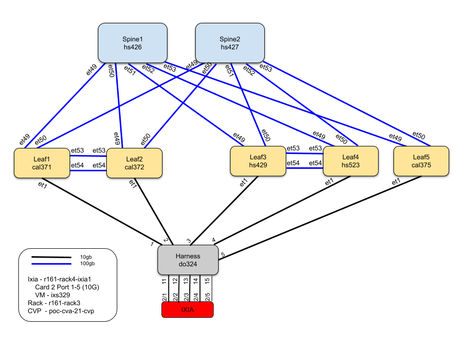

   
# Arista Validated Design with CloudVision deployment

## About

This example implement a basic __EVPN/VXLAN Fabric__ based on __[Arista Validated Design roles](https://github.com/aristanetworks/ansible-avd)__ with one layer of 2 spines and one layer of leafs (5 devices) using MLAG. Configuration deployment is not managed by eos EAPI, but through Arista CloudVision based on __[arista.cvp collection](https://github.com/aristanetworks/ansible-cvp/)__

It helps to demonstrate how to bring up an Arista EVPN/VXLAN Fabric from the first boot.



> Lab is based on physical topology and a CloudVision server running on a CloudVision Appliance. 

## Getting Started

For detailed setup and demo, please refer to [resources](#resources) below.


```shell
# Clone repository
$ https://gitlab.aristanetworks.com/sforstc/stdpoc-avd-topology.git

# Move to folder
$ cd stdpoc-avd-topology

# Install required ansible collections
$ ansible-galaxy collection install arista.avd:==2.0.0
$ ansible-galaxy collection install arista.cvp:==2.1.2

# Edit Inventory information & Authentication information
$ vim inventory/inventory.yml

# Power Up devices
# Wait for devices to be available in CVP

# Run Ansible playbook to test building the configurations
$ ansible-playbook playbooks/dc1-fabric-deploy-cvp.yml --tags build

# Run Ansible playbook to push the configurations to CVP and deploy them
$ ansible-playbook playbooks/dc1-fabric-deploy-cvp.yml --tags provision

# Rollback to ZTP on the DUTs (container/configlet delete is pending)
$ ansible-playbook playbooks/dc1-fabric-reset-cvp.yml
```

> Getting started does not include management IP configuration. For complete installation, please refer to [installation guide](INSTALLATION.md) to configure correct environment.

## Resources

- Ansible [Arista Validated Design](https://github.com/aristanetworks/ansible-avd) repository.
- [Ansible CloudVision Collection](https://github.com/aristanetworks/ansible-cvp) repository.
- [How to install](INSTALLATION.md) demo environment.
- [Detailed demo script](DEMO.md).

## License

Project is published under [Apache License](LICENSE).
